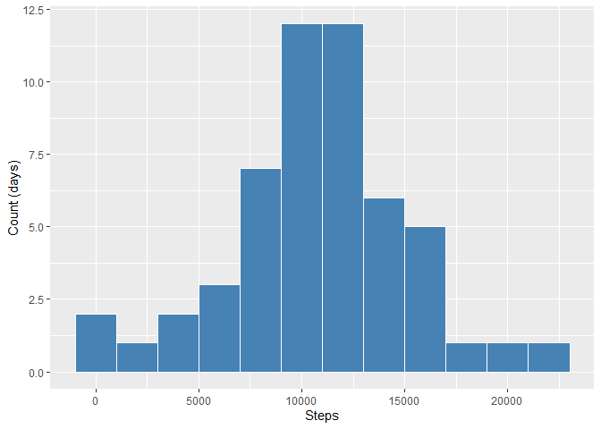
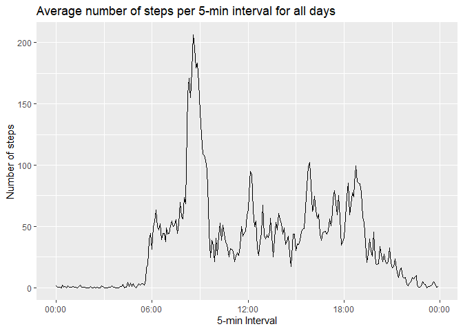
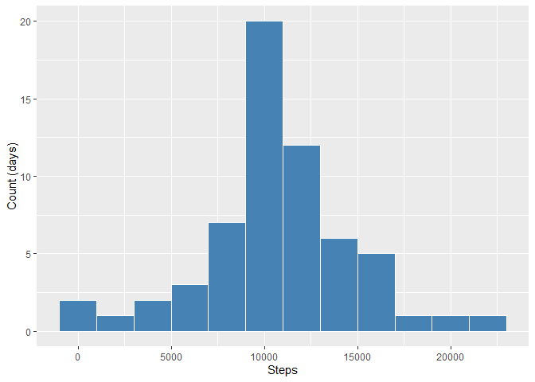
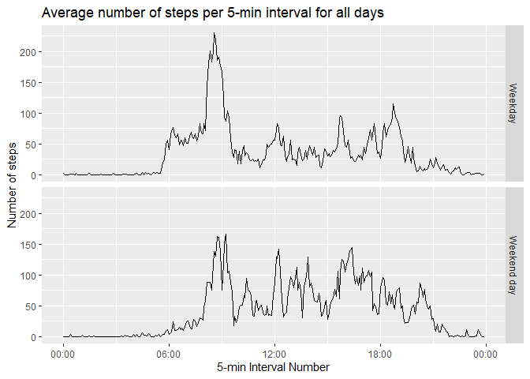

## Loading and preprocessing the data


```r
# Load required libraries
library(stringr)
library(ggplot2)
library(scales)

data <- read.csv("activity.csv")

# Create a true time value for the interval.  Note that this will include the current system date, but the date will be the same for all records, while the time component will vary.
data$time <- str_pad(data$interval,width=4,side="left",pad="0")         # Add leading zeros
data$time <- paste0(str_sub(data$time,1,2),":",str_sub(data$time,3,4))  # Include colon separator between hours and minutes
data$time <- as.POSIXct(data$time, tz="UTC", format="%H:%M")            # Convert to datetime class (POSIXlt)

# View 5 random rows, note how the date included with the time is constant (current system date), regardless of the date corresponding to the observation...
data[sample(nrow(data), 5),]
```

```
##       steps       date interval                time
## 7340    313 2012-10-26     1135 2020-04-01 11:35:00
## 14739     0 2012-11-21      410 2020-04-01 04:10:00
## 17001     0 2012-11-29       40 2020-04-01 00:40:00
## 10295    85 2012-11-05     1750 2020-04-01 17:50:00
## 16228    25 2012-11-26      815 2020-04-01 08:15:00
```

## What is mean total number of steps taken per day?

*Calculate the total number of steps taken per day. Make a histogram of the total number of steps taken each day.*

First we create a table of total steps per date, using the aggregate function.  
Then we plot this using ggplot and the histogram geom.


```r
DailySteps <- aggregate(steps ~ date, data=data, sum, na.rm=TRUE, drop=FALSE)
ggplot(DailySteps, aes(x=steps)) +
        geom_histogram(binwidth=2000, col="white", fill="steelblue") +
        labs(x = "Steps", y = "Count (days)")
```

```
## Warning: Removed 8 rows containing non-finite values (stat_bin).
```

<!-- -->

*Calculate and report the mean and median of the total number of steps taken per day*

Next we find the mean:

```r
mean(DailySteps$steps, na.rm=TRUE)
```

```
## [1] 10766.19
```
...and the median:

```r
median(DailySteps$steps, na.rm=TRUE)
```

```
## [1] 10765
```


## What is the average daily activity pattern?

*Make a time series plot of the 5-minute interval (x-axis) and the average number of steps taken, averaged across all days (y-axis)*

First we create a table of the average steps per time interval across all days, using the aggregate function...

```r
IntervalSteps.Mean <- aggregate(steps ~ time, data=data, mean, na.rm=TRUE, drop=FALSE)
head(IntervalSteps.Mean)
```

```
##                  time     steps
## 1 2020-04-01 00:00:00 1.7169811
## 2 2020-04-01 00:05:00 0.3396226
## 3 2020-04-01 00:10:00 0.1320755
## 4 2020-04-01 00:15:00 0.1509434
## 5 2020-04-01 00:20:00 0.0754717
## 6 2020-04-01 00:25:00 2.0943396
```

Next we plot the results using ggplot...

```r
ggplot(IntervalSteps.Mean) +
        geom_line(aes(y=steps, x=time)) +
        scale_x_datetime(labels = date_format("%H:%M")) +
        labs(x = "5-min Interval",
             y = "Number of steps",
             title = "Average number of steps per 5-min interval for all days")
```

<!-- -->

*Which 5-minute interval, on average across all the days in the dataset, contains the maximum number of steps?*

First we find the interval number with the greatest number of steps. Next we extract the time period corresponding to this interval number...


```r
Interval.Max <- which.max(IntervalSteps.Mean$steps)
Interval.Max
```

```
## [1] 104
```

```r
paste0(format(IntervalSteps.Mean$time[Interval.Max],"%H:%M"),"-",
       format(IntervalSteps.Mean$time[Interval.Max+1],"%H:%M"))
```

```
## [1] "08:35-08:40"
```


## Imputing missing values

*Calculate and report the total number of missing values in the dataset (i.e. the total number of rows with NAs).*


```r
sum(is.na(data$steps))
```

```
## [1] 2304
```

*Devise a strategy for filling in all of the missing values in the dataset. The strategy does not need to be sophisticated. For example, you could use the mean/median for that day, or the mean for that 5-minute interval, etc.*

We choose to fill NAs using the mean value for the same 5-minute interval across all days.

```r
# Add average data for interval as an additional column
data.filled <- merge(x=data, y=IntervalSteps.Mean, by.x="time", by.y="time")
# Re-sort the dataframe by date and interval
data.filled <- data.filled[order(data.filled$date,data.filled$interval),]
# Calculate the filled steps based on whether the original was NA or not.
data.filled$steps <- with(data.filled, ifelse(is.na(steps.x),steps.y,steps.x))
```


*Make a histogram of the total number of steps taken each day and Calculate and report the mean and median total number of steps taken per day. Do these values differ from the estimates from the first part of the assignment? What is the impact of imputing missing data on the estimates of the total daily number of steps?*


```r
DailySteps.Filled <- aggregate(steps ~ date, data=data.filled, sum, na.rm=TRUE, drop=FALSE)
ggplot(DailySteps.Filled, aes(x=steps)) +
        geom_histogram(binwidth=2000, col="white", fill="steelblue") +
        labs(x = "Steps", y = "Count (days)")
```

<!-- -->

```r
mean(DailySteps.Filled$steps)
```

```
## [1] 10766.19
```

```r
median(DailySteps.Filled$steps)
```

```
## [1] 10766.19
```

Since NAs the data for any date in the data set is either all NAs or has no NAs, the only change that the fill will make to the data is to replace the total for certain days with a constant value (10,766.19) which is by definition also the average number of steps for days without NAs.

Therefore the fill does not change the mean number of daily steps.  However, it does change the median as the distribution is altered by the filled data.

## Are there differences in activity patterns between weekdays and weekends?

*Create a new factor variable in the dataset with two levels – “weekday” and “weekend” indicating whether a given date is a weekday or weekend day.*

We use the wday element of the POSIXlt class rather than the weekday() function as the latter would be contingent on the locale of the system.


```r
data.filled$date <- as.POSIXlt(data.filled$date, format="%Y-%m-%d")
data.filled$weekday <- ifelse(data.filled$date$wday %in% c(0,6),"Weekend day","Weekday")
```
*Make a panel plot containing a time series plot (i.e. type="l") of the 5-minute interval (x-axis) and the average number of steps taken, averaged across all weekday days or weekend days (y-axis).*


```r
IntervalSteps.Mean <- aggregate(steps ~ time + weekday, data=data.filled, mean, na.rm=TRUE, drop=FALSE)
ggplot(IntervalSteps.Mean) +
        geom_line(aes(y=steps, x=time)) +
        facet_grid(weekday~.) +
        scale_x_datetime(labels = date_format("%H:%M")) +
        labs(x = "5-min Interval Number",
             y = "Number of steps",
             title = "Average number of steps per 5-min interval for all days")
```

<!-- -->

As the plot above shows, there are clear difference between weekday and weekend activity. For instance, on weekdays activity begins just before 6am, while on weekends it is generally after 7:30am.  Activity is also more distributed throughout the day at weekends, instead of having a few clear peaks.
